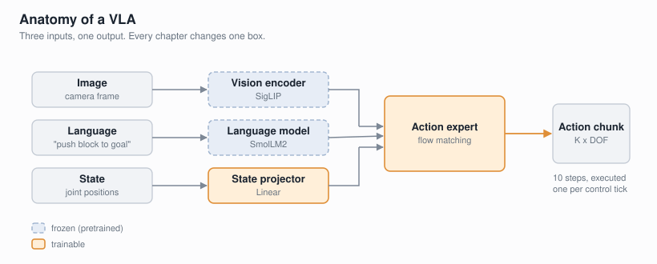

# What a VLA actually is

*Chapter 0 of [vla-from-scratch](https://github.com/FanFeast/vla-from-scratch).*

A **Vision-Language-Action model** takes a camera image and a sentence, and emits
robot actions. That is the whole definition. Everything interesting is in how you
fill in the three boxes.



The term comes from [RT-2 (Zitkovich et al., 2023)](https://arxiv.org/abs/2307.15818),
which made the observation that if you already have a vision-language model that
knows what a banana is, you should not be teaching a robot policy that from
scratch. Fine-tune the VLM to emit actions instead of text, and it inherits the
semantics for free.

## The data unit

Every VLA in this series trains on the same tuple:

```
(image, instruction, action)
```

That is it. No reward, no exploration, no environment interaction during
training. This is **behavior cloning** — supervised learning where the label
happens to be a robot action. If you can train an image classifier, you already
know the training loop.

It also means the ceiling is the demonstrator. A behavior-cloned policy does not
discover a better way to stack a block; it approximates the way a human did it,
including the hesitations.

## Three design axes

Almost every architectural argument in the VLA literature is one of these three.

### 1. How do you encode the image?

Train a CNN from scratch, or freeze a pretrained encoder like CLIP or SigLIP.
Chapter 2 measures this and the gap is not subtle.

### 2. How do you represent the action?

This is the axis with the most real disagreement:

- **Discrete tokens.** Quantize each dimension into 256 bins, predict a bin like
  a language token. RT-2 and [OpenVLA (Kim et al., 2024)](https://arxiv.org/abs/2406.09246)
  do this. It lets you reuse an LM head unchanged.
- **Continuous regression.** Predict the number directly with an MSE loss.
  Simplest and cheapest.
- **Generative.** Diffusion or flow matching, sampling an action from a learned
  distribution. [pi0 (Physical Intelligence, 2024)](https://arxiv.org/abs/2410.24164)
  and [SmolVLA (Shukor et al., 2025)](https://arxiv.org/abs/2506.01844) use flow
  matching.

Chapter 4 builds all three. Chapter 6 explains why the field converged on the
third one, by first showing it failing.

### 3. One action, or a chunk?

Predict the next action, or the next K actions at once. [ACT (Zhao et al., 2023)](https://arxiv.org/abs/2304.13705)
popularized **action chunking**, and Chapter 4 finds it is the single biggest
lever in the entire series — bigger than the choice of head.

## What we build

Ten chapters, each adding exactly one concept, ending at a SmolVLA-like model:
frozen SigLIP vision, a frozen SmolLM2 language backbone, and a trainable
flow-matching action expert, trained on real SO100 robot data, LoRA fine-tuned,
and benchmarked closed-loop.

The parts that will surprise you, if you have only read papers:

- A pretrained vision encoder is worth more than a bigger policy (Ch 2).
- Cross-attention, the sophisticated choice, loses to concatenation on a simple
  task — and costs 40× more to train (Ch 3).
- A policy can reach 0.05 MAE on held-out frames and still fail 100% of rollouts
  (Ch 5).
- Making the model *smaller* is what fixed our diffusion policy (Ch 6).

**Next:** [Chapter 1](01-tiny-vla.md) builds a complete VLA in about 200 lines,
with nothing pretrained.
