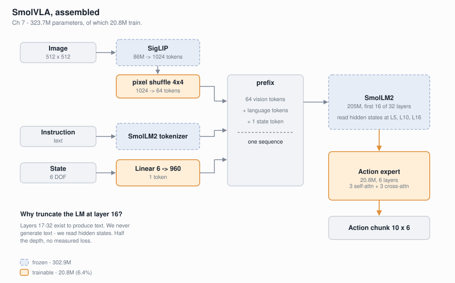
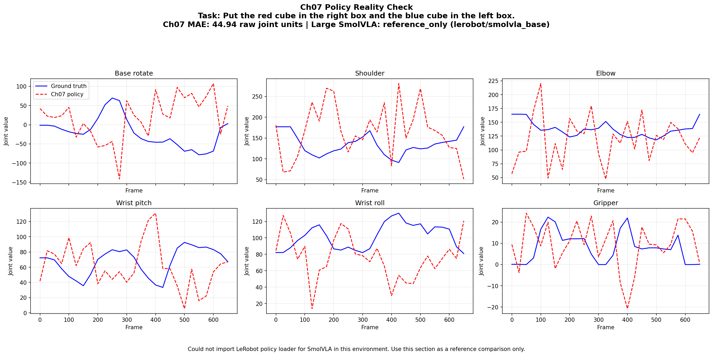

# Assembling the whole thing

*Chapter 7 of [vla-from-scratch](https://github.com/FanFeast/vla-from-scratch).*

Six chapters of parts. This one bolts them together into a SmolVLA-like model and
trains it on real SO100 robot data: **323.7M parameters, of which 20.8M train.**



## The assembly

```
Image    -> SigLIP (frozen) -> pixel shuffle 4x4 -> connector -> 64 tokens x 960
Language -> SmolLM2 tokenizer ---------------------------------\
State    -> Linear(6 -> 960) -> 1 token ------------------------> prefix
Prefix   -> SmolLM2 (frozen, first 16 of 32 layers) -> hidden states @ L5, L10, L16
Actions  -> Flow-matching action expert (trainable) -> chunk (10 x 6)
```

Three decisions carry the design.

### Only the action expert trains

The backbone is `SmolVLM2-500M-Video-Instruct`, frozen. 20.8M trainable of 323.7M
— **6.4%**.

This is Chapter 2's lesson at scale. The backbone already knows what a cube and a
gripper look like. The action expert only has to learn how *this* robot moves.

### Pixel shuffle: 1024 tokens → 64

SigLIP on a 512×512 image produces 1024 patch tokens. Feeding all of them into the
language model would dominate both the prefix and the compute budget.

`pixel_shuffle` trades **space for channels**: a 4×4 block of neighbouring patches
folds into one token with 16× the channel width.

```python
>>> x = torch.randn(1, 1024, 768)
>>> pixel_shuffle(x, scale_factor=4).shape
torch.Size([1, 64, 12288])
```

Nothing is discarded — `x.numel()` is unchanged. The information is rearranged,
and the sequence gets 16× shorter.

### The language model is truncated at half depth

We run **16 of SmolLM2's 32 layers**.

Layers 17–32 exist to produce text. We never generate text — we read hidden states
at L5, L10, and L16 as conditioning for the action expert. Half the depth, no
measured loss, half the prefix cost.

## Data

| Dataset | Episodes | Frames | Task |
|---|---|---|---|
| `lerobot/svla_so100_pickplace` | 50 | 19,631 | Pick up cube, place in box |
| `lerobot/svla_so100_stacking` | 56 | 22,956 | Stack blocks |
| `lerobot/svla_so100_sorting` | 52 | 35,713 | Sort objects by colour |
| **Total** | **158** | **78,300** | |

## Two-phase training

1. **Extraction (~35 min, once).** Decode video, run SigLIP + pixel shuffle +
   connector, cache 9.7 GB of vision tokens. This removes the vision encoder from
   the training loop entirely.
2. **Training (~3.2 h).** Load cached tokens, run frozen SmolLM2 per batch, train
   the action expert with flow matching. ~58 s/epoch on an RTX 4090.

## Results (200 epochs)

| Checkpoint | Train loss | Val loss | Val MAE (norm) | Val MAE (raw) |
|---|---|---|---|---|
| Epoch 25 | 0.71 | 0.20 | 3.36 | 77.9 |
| Epoch 50 | 0.57 | 0.24 | 2.98 | 69.1 |
| **Epoch 100** | 0.89 | 0.80 | **2.22** | **51.4** |
| Epoch 150 | 0.56 | 0.48 | 2.43 | 56.2 |
| Epoch 200 | 0.63 | 0.59 | 2.41 | 55.9 |

**The best checkpoint is epoch 100, not 200.** MAE improves 34% from epoch 25 to
100, then drifts as the model starts memorizing 158 episodes. Train loss keeps
falling the whole time — another reminder to select on validation.

## Raw MAE is 51.4, and that is a data problem

The model learns real structure but is not task-competent. The reason is not the
architecture: **SmolVLA trained on 481 datasets; we used 3.**

Saying that plainly is more useful than a curve that looks nice. The pipeline is
correct end to end — raw video and a sentence in, a 6-DOF action chunk out — and
it is starved.

## Check the policy, not the loss

`policy_reality_check.py` replays held-out episodes and plots the predicted chunk
against the action the human actually commanded.



Chapter 5 taught this lesson the expensive way. This is the cheap way to keep
checking it.

**Next:** [Chapter 8](08-lora-finetuning.md) adapts that frozen backbone with 0.13%
of the parameters — and measures whether it actually helped.
