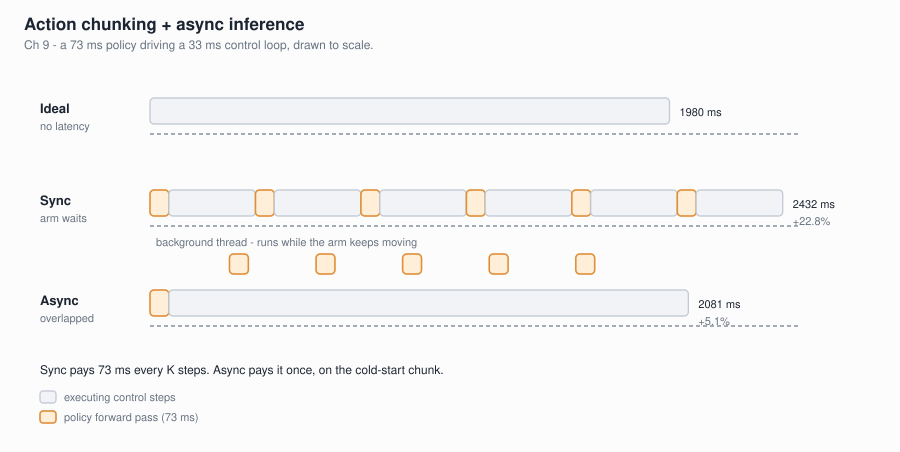

# Latency is the last boss

*Chapter 9 of [vla-from-scratch](https://github.com/FanFeast/vla-from-scratch).*

A robot arm runs its control loop at 30 Hz — a new action every **33 ms**. One
forward pass of our Chapter 7 SmolVLA takes **73 ms** on an RTX 4090.

The policy is 2.2× too slow to be called every step. No amount of kernel tuning
fixes that. The fix is to stop calling it every step.

## Action chunking, again

The model already predicts **K future actions at once** — that is what Chapters 4
and 6 built. So call it once, then execute the chunk one action per control tick.
One inference now covers K steps, and the effective requirement becomes 330 ms
instead of 33 ms.

`ActionChunkBuffer` is just a FIFO of single actions popped from those chunks.

## Sync stalls; async overlaps



**Sync** runs the buffer dry, then blocks for 73 ms while the arm waits. The arm
stutters every K steps.

**Async** fires the next inference on a background thread *before* the buffer
empties, so it completes while the arm is still executing buffered actions.

## Measured, on the real Chapter 7 model

60 steps at 30 Hz, RTX 4090:

| | Raw latency | Rollout wall | Overhead | Policy calls |
|---|---|---|---|---|
| ideal | — | 1980 ms | — | — |
| Sync | 72.6 ± 1.8 ms | 2432 ms | **+22.8%** | 6 |
| Async | (hidden) | 2081 ms | **+5.1%** | 7 |

Async pays the 73 ms **once**, on the cold-start chunk. Sync pays it every 10
steps. One extra policy call buys back 351 ms.

## Does async change what the robot does?

The guarantee is precise, and worth stating exactly.

**Fed the same observation, async emits exactly the actions sync would.** The
controller logic is identical; only the moment of inference moves. The test suite
asserts this with a constant observation.

**In a live rollout, the actions differ slightly — and that is a feature.** Async
replans a few steps early, so it queries the policy on a *fresher* observation.
Over 60 steps, 10 of them differ, by at most 4.4e-04. Not a bug; async is acting
on newer information.

It would have been easy to write "async is identical to sync" and move on. It is
not, and the reason it is not is the interesting part.

## Temporal ensembling

Chunks overlap: at step *t* you may hold predictions for *t* made at several
earlier timesteps. [ACT](https://arxiv.org/abs/2304.13705) averages them with
exponentially higher weight on the freshest, smoothing the seam where one chunk
hands off to the next.

```
t=0: action=[1. 1.]        <- 1 prediction
t=2: action=[1.525 1.525]  <- 2 predictions, fresher weighted higher
```

## Evaluate closed-loop or do not bother

The eval harness reports **success rate**, episode length, and action
**smoothness** — jerky policies wear out hardware.

It ships with `MockManipulationEnv`, a dependency-free reaching task, so the
harness is exercisable with no simulator. **LIBERO** is the benchmark the field
actually reports on; it is not on PyPI and pulls in MuJoCo, so `make_libero_env`
is gated and raises with install guidance rather than failing obscurely.

We did not run the real LIBERO suites. Our SO100 model would not be competitive on
them, and the harness is identical either way — but that is a gap, and it is
listed as one rather than glossed.

## What the whole series adds up to

Ten chapters, and the through-line was never "here is a thing that works." It was
a chain of honest failures:

- A scratch CNN gets **0%** at 224×224 → borrow a pretrained encoder (Ch 2).
- Cross-attention loses to concatenation at **40× the cost** → sophistication is
  not free (Ch 3).
- Regression hits **95%** on a toy task → because the task was unimodal (Ch 4).
- The same head gets **0%** on human data at 0.05 MAE → offline metrics lie (Ch 5).
- A 96.3M denoiser overfits; **12.4M** works → capacity must match your data (Ch 6).
- The best checkpoint is **epoch 100 of 200** → select on validation (Ch 7).
- LoRA gains **+5.3%**, verified over 8 paired seeds → check before believing (Ch 8).
- A 73 ms policy drives a 33 ms loop → **change the architecture, not the kernel** (Ch 9).

**Where this goes next** — and we did not build these: RL fine-tuning past the
limits of behavior cloning, sim-to-real transfer, and multi-embodiment models that
share one policy across robot morphologies.

The code is at [FanFeast/vla-from-scratch](https://github.com/FanFeast/vla-from-scratch).
Every chapter has a Colab notebook, a locked environment, and tests.
