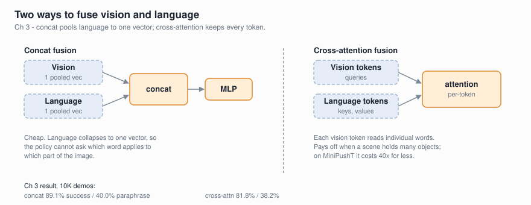

# Chapter 3: Language Conditioning

**Goal:** Replace the lookup-table language encoder from Chapter 2 with a real
language model (SmolLM2) and introduce **cross-attention fusion**, so the VLA
can follow natural language instructions — including paraphrases it has never
seen during training.



## Training Recipe

| Parameter | Quick (`--preset quick`) | Full (`--preset full`) | Scale (`--preset scale`) |
|-----------|-------------------------|----------------------|------------------------|
| Resolution | 64x64 | 224x224 | 224x224 |
| Demos | 220 episodes (~18k trans.) | 2200 episodes (~180k trans.) | 10000 episodes (~736k trans.) |
| Batch size | 64 | 64 | 512 |
| Learning rate | 1e-3 | 1e-3 | 1e-3 (cosine decay) |
| Epochs | 10 | 40 | 100 |
| Mixed precision | No | No | bf16 AMP |
| Hardware | Any GPU (T4 OK) | RTX 4090 recommended | RTX 4090 required |
| Time (all 4 configs) | ~10 min | ~2-3 hrs | ~22 hrs |

## Setup

```bash
uv venv .venv
source .venv/bin/activate
uv pip install -r requirements.txt

# Quick test (~10min, downloads SmolLM2-135M ~270MB + SigLIP ~350MB)
python cross_attention.py --preset quick --eval-paraphrase --no-viz

# Full comparison (~2-3hrs on RTX 4090)
python cross_attention.py --preset full --eval-paraphrase
```

First run downloads SmolLM2-135M (~270MB), SmolLM2-360M (~724MB), and SigLIP
(~350MB) from HuggingFace.

## What Changed From Chapter 2

Three things changed. Everything else is identical.

1. **11 instructions instead of 1.** The environment now supports 11 canonical
   instructions across 4 behavior categories (goal-seeking, push-direction,
   agent-movement, push-to-location), each with 3-5 paraphrases (~37 total).

2. **Language encoder is now a real LM.** Instead of a fixed lookup table that
   maps instruction strings to learned embeddings, we use a frozen SmolLM2
   (135M or 360M) to encode instructions into dense representations.

3. **Cross-attention fusion.** Instead of concatenating a single CLS vector,
   vision patch tokens attend to language token sequences via multi-head
   cross-attention — the same mechanism used in production VLAs like SmolVLA.

## The 11 Instructions

The environment supports 4 behavior categories:

| Category | Instructions | Expert Behavior |
|----------|-------------|-----------------|
| **Goal** | "push block to goal" | Push block toward green marker |
| **Push direction** | "push block up/down/left/right" | Push block to the specified edge |
| **Agent movement** | "move agent up/down/left/right" | Move agent to the specified edge (ignore block) |
| **Push to location** | "push block to center" | Push block toward center of arena |

Each instruction has 3-5 paraphrases. For example:
- "push block to goal" → "move the block to the target", "guide block onto goal position", ...
- "push block up" → "nudge the block upward", "shove the block to the top", ...

The key test: can the model follow paraphrases it has **never seen during training**?

## The Four Configurations

We train and compare four VLA configurations that progressively improve:

### 1. Lookup + Concat (baseline)

Same approach as Chapter 2 but extended to 11 instructions. Each canonical
instruction gets a learnable embedding vector. Unknown strings (including
paraphrases) map to a zero vector.

```
instruction string → lookup table → (B, 256) embedding
                                         ↓
SigLIP features (B, 768) → concat → (B, 1024) → action head → (B, 5)
```

**Limitation:** Cannot generalize to paraphrases at all — they map to zeros.

### 2. SmolLM2-135M + Concat

Swap the lookup table for a frozen SmolLM2-135M. The LM encodes any instruction
string into a dense vector via mean-pooling over token hidden states, then a
trainable projection maps it to the fusion dimension.

```
instruction string → SmolLM2 (frozen) → mean pool → projection → (B, 256)
                                                                      ↓
SigLIP features (B, 768) → concat → (B, 512) → action head → (B, 5)
```

**Advantage:** SmolLM2 produces similar embeddings for semantically similar
strings, so "push block up" and "nudge the block upward" get similar vectors.

### 3. SmolLM2-135M + Cross-Attention

Replace concatenation with cross-attention. Instead of squashing language into
a single vector, we keep the full token sequence and let vision tokens attend
to it:

```
instruction → SmolLM2 (frozen) → projection → (B, T, 256) language tokens
                                                    ↓ K, V
SigLIP patches (B, 197, 768) → vision_proj → (B, 197, 256) → Q
                                                    ↓
                                          MultiHeadAttention(Q, K, V)
                                                    ↓
                                          LayerNorm + residual
                                                    ↓
                                          mean pool → (B, 256) → action head
```

**Advantage:** Each vision patch can attend to different parts of the
instruction. "Push the **block** to the **left**" — the block-related patches
attend to "block" while directional processing attends to "left".

### 4. SmolLM2-360M + Cross-Attention

Same architecture as config 3, but with the larger SmolLM2-360M backbone.
Tests whether a better language model improves instruction following.

## Scale Experiment Results (224x224, 10K demos, cosine LR, bf16 AMP, RTX 4090)

| Config | Trainable | Time | Loss | Success | Paraphrase |
|--------|-----------|------|------|---------|------------|
| Lookup + Concat | 332K | ~900s | 0.132 | 83.6% | 23.6% |
| SmolLM2-135M + Concat | 477K | 910s | 0.166 | **89.1%** | **40.0%** |
| SmolLM2-135M + CrossAttn | 642K | 37,897s | 0.244 | 81.8% | 38.2% |
| SmolLM2-360M + CrossAttn | 740K | 40,464s | 0.249 | 87.3% | 29.1% |

**Key takeaways:**

1. **SmolLM2 is the biggest lever.** Replacing the lookup table with SmolLM2
   jumps success from 83.6% → 89.1% and paraphrase from 23.6% → 40.0%.
   Pretrained language understanding matters far more than fusion mechanism.

2. **Concat beats cross-attention on this task.** Both SmolLM2 concat configs
   outperform their cross-attention counterparts. This is expected — see
   [Why Concat Wins Here](#why-concat-wins-here) below.

3. **Lookup baseline cannot generalize (23.6% paraphrase).** Without a real LM,
   paraphrases map to zero vectors — the model guesses from vision alone.

4. **Cross-attention trains 40x slower** because it runs SigLIP + SmolLM2
   forward passes every batch, while concat pre-computes embeddings once.

### Why Concat Wins Here

Cross-attention is the standard fusion mechanism in production VLAs (SmolVLA,
RT-2, OpenVLA). So why does simple concatenation beat it on our toy task?

**The task is too simple for cross-attention's advantages to matter.**
Cross-attention excels at **spatial grounding** — letting each vision patch
attend to specific words ("push the *left* block *behind* the red cup").
But MiniPushT has one block, one goal, five discrete actions, and short
instructions. A single pooled vector is sufficient.

**The optimization is harder.** Cross-attention must learn alignment between
196 vision patches and ~10 language tokens — a much harder optimization surface
than a concat+MLP. Both get 100 epochs of gradient steps, but cross-attention
converges to loss=0.244 while concat reaches 0.166.

**In production VLAs, cross-attention wins because:**
- Complex multi-object scenes require spatial grounding
- Continuous actions need precise vision-language alignment
- Diverse instruction sets benefit from compositional understanding
- Models train for millions of steps (not 100 epochs)
- Encoders are fine-tuned, not frozen

This is a useful lesson: **architecture choice depends on task complexity.**
Don't reach for cross-attention on a problem that concat can solve.

## Full Preset Results (224x224, 2200 demos, 40 epochs, constant LR)

| Config | Trainable | Time | Loss | Success | Paraphrase |
|--------|-----------|------|------|---------|------------|
| Lookup + Concat | 332K | 265s | 0.301 | 63.6% | 21.8% |
| SmolLM2-135M + Concat | 477K | 120s | 0.314 | **72.7%** | 34.5% |
| SmolLM2-135M + CrossAttn | 642K | 8408s | 0.326 | 58.2% | 27.3% |
| SmolLM2-360M + CrossAttn | 740K | 8619s | 0.314 | 63.6% | **38.2%** |

> Smaller-scale validation run. The scale experiment above supersedes these
> results with 5x more data, cosine LR decay, and bf16 mixed precision.

## Quick Preset Results (64x64, 220 demos, 10 epochs)

| Config | Trainable | Time | Loss | Success | Paraphrase |
|--------|-----------|------|------|---------|------------|
| Lookup + Concat | 332K | 8s | 0.478 | 36.4% | 16.4% |
| SmolLM2-135M + Concat | 477K | 4s | 0.508 | 34.5% | **27.3%** |
| SmolLM2-135M + CrossAttn | 642K | 241s | 0.488 | 36.4% | 23.6% |
| SmolLM2-360M + CrossAttn | 740K | 242s | 0.512 | **43.6%** | 16.4% |

> Quick preset is for validation only (~10 min). Full preset shows clearer separation.

## Key Concepts

### Why Cross-Attention?

In Chapter 2 we concatenated a single language vector with a single vision
vector. This works, but discards spatial information on both sides.

**Cross-attention** keeps the full sequence structure. The vision encoder
produces 197 patch tokens (196 patches + 1 CLS token for a 224x224 image with
16x16 patches). The language encoder produces T tokens (one per sub-word).
Cross-attention lets every vision patch attend to every language token:

```
Attention(Q, K, V) = softmax(Q @ K^T / sqrt(d)) @ V
    Q = vision tokens   (B, 197, d)  ← "what am I looking at?"
    K = language tokens  (B, T, d)    ← "what should I look for?"
    V = language tokens  (B, T, d)    ← "what information to extract?"
```

This is exactly how production VLAs like SmolVLA fuse vision and language.

### Why Freeze the LM?

SmolLM2-135M has 135M parameters. Our trainable fusion + action head has
~640K parameters. If we fine-tuned SmolLM2, the LM would overfit to our tiny
demo dataset in one epoch, and we would lose the pretrained language
understanding that gives us paraphrase generalization.

**Frozen LM + trainable projection** is the standard recipe:
- The LM provides rich, general-purpose text representations
- The projection layer learns to map them into the VLA's fusion space
- The cross-attention layers learn task-specific vision-language alignment

### Embedding Caching

For concat fusion, we can precompute SmolLM2 embeddings once and train
purely on cached vectors — this makes training as fast as the lookup baseline.

For cross-attention, we need the full token sequence each batch, so we run
SmolLM2's forward pass every step. The LM is frozen, so we use `torch.no_grad()`
and cache hidden states per unique instruction string to avoid redundant
computation.

## Architecture Details

| Component | Details |
|-----------|---------|
| Vision encoder | SigLIP ViT-B/16, frozen, 768-dim output |
| Language encoder | SmolLM2-135M or 360M, frozen, mean-pooled or full sequence |
| Vision projection | Linear(768 → 256) |
| Language projection | Linear(H → 256), where H=576 (135M) or 960 (360M) |
| Cross-attention | 1 layer, 4 heads, d_model=256, with LayerNorm + residual |
| Action head | Linear(256, 128) → ReLU → Linear(128, 5) |
| Training | Cross-entropy loss, Adam optimizer, lr=1e-3 |

## CLI Reference

```bash
# Presets (recommended)
python cross_attention.py --preset quick    # 64px, 220 demos, 10 epochs
python cross_attention.py --preset full     # 224px, 2200 demos, 40 epochs
python cross_attention.py --preset scale    # 224px, 10K demos, 100 epochs, cosine LR, bf16

# Custom configuration
python cross_attention.py \
  --size 224 \
  --n-demos 1000 \
  --epochs 20 \
  --fusion cross-attn \
  --lm smollm2-135m \
  --encoder google/siglip-base-patch16-224

# Evaluation flags
python cross_attention.py --preset quick --eval-paraphrase  # Test paraphrase generalization
python cross_attention.py --preset quick --no-viz           # Skip matplotlib plots

# Run single configuration
python cross_attention.py --preset quick --fusion concat --lm lookup

# Force retrain (ignore cached checkpoints)
python cross_attention.py --preset scale --force-retrain --eval-paraphrase

# Early stopping
python cross_attention.py --preset scale --patience 20  # Stop if loss plateaus for 20 epochs
```

### Flags

| Flag | Options | Default |
|------|---------|---------|
| `--preset` | `quick`, `full`, `scale` | (required unless manual flags) |
| `--fusion` | `concat`, `cross-attn` | all (in preset mode) |
| `--lm` | `lookup`, `smollm2-135m`, `smollm2-360m` | all (in preset mode) |
| `--encoder` | Any HuggingFace ViT model | `google/siglip-base-patch16-224` |
| `--eval-paraphrase` | flag | off |
| `--no-viz` | flag | off |
| `--patience` | int | 0 (disabled) |
| `--force-retrain` | flag | off |
| `--size` | 64, 224 | set by preset |
| `--n-demos` | int | set by preset |
| `--epochs` | int | set by preset |
| `--batch-size` | int | 64 (512 for scale) |

## Files

| File | Description |
|------|-------------|
| `cross_attention.py` | Main script: encoders, fusion, training, eval, CLI |
| `mini_pusht.py` | Enhanced MiniPushT env with 11 instructions + paraphrases |
| `live_rollout.py` | Pygame live visualizer — 4 models side-by-side |
| `requirements.txt` | Chapter dependencies |
| `test_chapter_03.py` | 25 tests (env, encoders, fusion, VLA, training) |

## Live Rollout Viewer

Watch all 4 models run side-by-side in real time with Pygame:

```bash
python live_rollout.py                         # scale checkpoints (default)
python live_rollout.py --preset full           # full preset checkpoints
python live_rollout.py --speed 10              # run at 10 FPS
```

**Controls:**

| Key | Action |
|-----|--------|
| SPACE | Pause / resume |
| R | Reset all envs (random seed) |
| N | Next seed (+1) |
| I | Cycle to next instruction |
| P | Toggle paraphrase mode |
| Q / ESC | Quit |

All 4 envs use the same instruction and seed so you can compare how each
architecture handles the exact same situation.

## Running Tests

```bash
python -m pytest test_chapter_03.py -v
```

The test suite validates:
- Environment with all 11 instructions and paraphrases
- Expert solving all instruction types
- Encoder output shapes (lookup and SmolLM2)
- Fusion module shapes (concat and cross-attention with padding masks)
- VLA forward pass, single training step, and evaluation loop

## Next Chapter

**Chapter 4: Action Representations** — swap discrete actions (5 buttons) for
continuous action spaces, and compare MSE regression, discrete tokenization
(RT-2 style), and diffusion/flow-matching action heads.
