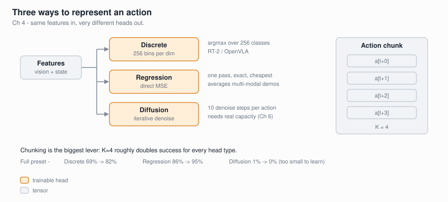

# Chapter 4: Action Representations

**Goal:** Compare three fundamentally different ways to represent robot actions —
**discrete tokenization** (RT-2/OpenVLA style), **MSE regression**, and
**diffusion denoising** (pi0/SmolVLA style) — with and without **action chunking**
(K=1 vs K=4), all on the same continuous-action MiniPushT environment.



## Training Recipe

| Parameter | Quick (`--preset quick`) | Full (`--preset full`) |
|-----------|-------------------------|----------------------|
| Resolution | 224x224 (SigLIP native) | 224x224 |
| Demos | 1000 episodes (~73k trans.) | 3000 episodes (~219k trans.) |
| Batch size | 128 | 256 |
| Learning rate | 1e-3 (cosine decay to 0) | 1e-3 (cosine decay to 0) |
| Max epochs | 200 | 200 |
| Early stopping | patience=20 | patience=20 |
| Mixed precision | bf16 AMP | bf16 AMP |
| Configs trained | 6 (3 heads x 2 chunk sizes) | 6 |
| Hardware | RTX 4090 (24GB) | RTX 4090 (24GB) |
| Time (all 6 configs) | ~13 min training + ~5 min eval | ~23 min training + ~5 min eval |

## Setup

```bash
cd chapters/04_action_representations

# Quick experiment (~18 min total)
python action_heads.py --preset quick --epochs 200 --patience 20 --device cuda

# Full experiment (~28 min total)
python action_heads.py --preset full --epochs 200 --patience 20 --device cuda

# Live visualization (requires pygame)
pip install pygame
python live_rollout.py --preset full --chunk-size 4 --epochs 200 --device cuda
```

First run collects demonstrations and downloads SigLIP (~350MB) from HuggingFace.

## What Changed From Chapter 3

1. **Continuous actions.** The environment now outputs (dx, dy) in [-1, 1] instead
   of discrete up/down/left/right. This is closer to real robot joint/velocity commands.

2. **Three action heads compared.** Same frozen SigLIP vision encoder, same data,
   but three completely different ways to decode actions from the visual features.

3. **Action chunking.** Instead of predicting one action per timestep (K=1), models
   can predict K=4 future actions at once, improving trajectory coherence.

## The Three Action Heads

### 1. Discrete Tokenization (RT-2 / OpenVLA Style)

Each continuous action dimension is quantized into 256 bins, then predicted as a
classification problem. For K=4 chunking with 2D actions, the head outputs
4 × 2 × 256 = 2048 logits.

```
features (832) → MLP → K*D*256 logits → argmax → de-quantize to continuous
Loss: cross-entropy per bin
```

**Pros:** Simple, works with standard LM training (just more tokens).
**Cons:** Loses precision from quantization, can't represent multi-modal distributions
well (one bin must win).

### 2. MSE Regression

Direct prediction of continuous action values through a Tanh-bounded MLP.

```
features (832) → MLP (256→128) → Tanh → K*D continuous values
Loss: mean squared error
```

**Pros:** Simple, fast inference, preserves full continuous precision.
**Cons:** Predicts the **mean** action — fails on multi-modal distributions
(e.g., "go left OR right" averages to "don't move").

### 3. Diffusion / DDPM Denoising (pi0 / SmolVLA Style)

Learns to iteratively denoise random Gaussian noise into coherent actions,
conditioned on visual features. Uses 100 diffusion timesteps during training,
10 DDIM-style inference steps.

```
noise ~ N(0,1) → denoise network (conditioned on features + timestep) → action
Loss: MSE between predicted and actual noise (epsilon-prediction)
```

**Pros:** Can model arbitrary multi-modal action distributions.
**Cons:** Slow inference (multiple denoising steps), needs significantly more
training data and epochs to converge.

## Results

### Quick Preset (1000 demos, 200 epochs)

| Config | Success Rate | Smoothness ↓ | Avg Length ↓ |
|--------|-------------|--------------|--------------|
| Discrete K=1 | 55% | 0.766 | 131 |
| Discrete K=4 | 79% | 0.246 | 106 |
| Regression K=1 | 71% | 0.215 | 114 |
| **Regression K=4** | **86%** | **0.126** | **100** |
| Diffusion K=1 | 1% | 1.188 | 200 |
| Diffusion K=4 | 0% | 1.086 | 200 |

### Full Preset (3000 demos, 200 epochs)

| Config | Success Rate | Smoothness ↓ | Avg Length ↓ |
|--------|-------------|--------------|--------------|
| Discrete K=1 | 69% | 0.630 | 113 |
| Discrete K=4 | 82% | 0.206 | 97 |
| Regression K=1 | 86% | 0.215 | 94 |
| **Regression K=4** | **95%** | **0.101** | **83** |
| Diffusion K=1 | 1% | 1.177 | 200 |
| Diffusion K=4 | 0% | 1.086 | 200 |

*Smoothness = mean L2 between consecutive actions (lower = smoother trajectories).
Avg Length = mean episode length (lower = faster task completion, max 200).*

## Key Takeaways

### 1. Action Chunking is the Single Biggest Win

Across every head type, predicting K=4 future actions at once dramatically improves
performance. Discrete jumps from 55% → 79% (quick) and 69% → 82% (full).
Regression jumps from 71% → 86% and 86% → 95%.

**Why:** Single-step prediction is inherently reactive — the agent re-plans every
timestep, causing jittery, indecisive movement. Chunking forces temporal coherence,
producing smooth trajectories that commit to a direction.

### 2. Regression Wins on Unimodal Tasks

MSE regression dominates this benchmark because MiniPushT has a single correct
behavior at each state: push toward the goal. There's no multi-modality — you never
need to choose between two equally valid strategies.

**When regression fails:** Real robot tasks where multiple strategies are valid
(e.g., pick up a cup from the left OR right side). Regression averages the modes
and the robot freezes. This is why production VLAs use diffusion or discrete tokens.

### 3. Diffusion Needs Scale to Shine

DDPM at 0% isn't broken — it's underpowered for this setting:
- **10 inference steps** is too few for the linear beta schedule to produce clean actions
- The **simple 2-layer MLP denoiser** lacks capacity for the conditional generation task
- There's **no multi-modality** in this environment to justify the overhead

In production (pi0, SmolVLA), diffusion action experts use:
- 100M+ parameter transformer denoisers (not 2-layer MLPs)
- Flow matching (not DDPM) — simpler ODE, fewer steps needed
- Multi-modal real robot data where the distributional expressiveness pays off

We'll build a proper flow-matching action expert in **Chapter 6**.

### 4. More Data Helps Everything

3x more demonstrations (1000 → 3000) consistently improved results by 10-15%
across all heads. Regression K=4 went from 86% → 95%.

## Architecture Details

All configs share the same frozen SigLIP vision encoder. Only the action head differs.

```
Image (224x224) → SigLIP (frozen) → 768-dim embedding
                                          ↓
                              + task embedding (64-dim)
                                          ↓
                                    832-dim features
                                          ↓
                              ┌────────────┼────────────┐
                              ▼            ▼            ▼
                         Discrete    Regression    Diffusion
                        (CE loss)    (MSE loss)   (DDPM loss)
```

## Live Visualization

The Pygame viewer shows all 3 heads running side-by-side on the same episode:

```bash
pip install pygame
python live_rollout.py --preset full --chunk-size 4 --epochs 200 --device cuda
```

**Controls:** SPACE=pause, R=reset, N=next seed, K=toggle chunk size, Q=quit

## Files

| File | Description |
|------|-------------|
| `action_heads.py` | Main script: models, training, eval, CLI |
| `mini_pusht_continuous.py` | Continuous-action MiniPushT environment |
| `live_rollout.py` | Pygame side-by-side viewer |
| `test_chapter_04.py` | 16 unit tests (env + models) |

## What's Next

Chapter 5 scales up to **real robot data** (Open X-Embodiment, LeRobot format).
Chapter 6 builds a proper **flow-matching action expert** — a 100M parameter
transformer with interleaved cross/self-attention that makes diffusion-style
generation actually work.
