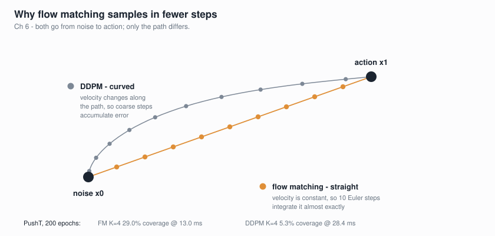
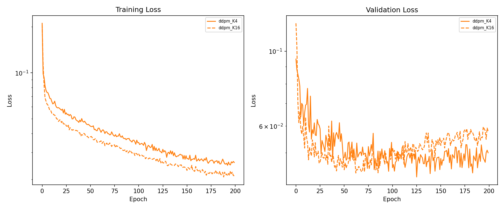
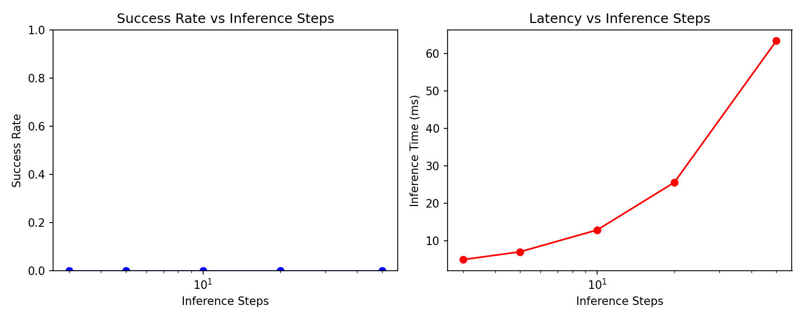

# Chapter 6: Flow Matching — Building the Action Expert

**Goal:** Build a transformer-based **action expert** that generates action chunks using
**flow matching** (rectified flow), and compare it side-by-side with **DDPM** (denoising
diffusion). This is the denoiser architecture used in modern VLAs like
[pi0](https://arxiv.org/abs/2410.24164) and [SmolVLA](https://arxiv.org/abs/2506.01844).



In Chapter 4 we tried a simplified diffusion head (MLP denoiser). Here we build the real
thing: a transformer with interleaved self-attention and cross-attention blocks, trained
with both flow matching and DDPM so you can see why the field moved to flow matching.

## Training Recipe

| Parameter | Value |
|-----------|-------|
| Architecture | ActionExpertTransformer (12.4M params) |
| Layers | 6 interleaved blocks (self-attn + cross-attn + FFN) |
| Hidden dim | 384, 6 heads, FFN dim 1024 |
| Dropout | 0.1 |
| Epochs | 200 (no early stopping) |
| Learning rate | 1e-4 (cosine decay to 0) |
| Optimizer | AdamW (weight_decay=0.01) |
| Batch size | 64 |
| Mixed precision | bf16 AMP |
| Gradient clipping | max_norm=1.0 |
| EMA decay | 0.999 |
| FM inference | 10 Euler steps (default) |
| DDPM inference | 20 reverse steps |
| Hardware | RTX 4090 (24GB) |

## Setup

```bash
cd chapters/06_flow_matching

# Install dependencies
# - the [dataset] extra provides LeRobotDataset, which extract_and_cache imports
# - gym-pusht still calls pymunk's add_collision_handler, removed in pymunk 7
pip install 'lerobot[dataset]' gym-pusht gym-aloha 'pymunk<7'

# Run PushT experiments (FM + DDPM, K4 + K16 — ~45 min total)
python flow_matching.py --preset pusht

# Run ALOHA experiments (~40 min total)
python flow_matching.py --preset aloha

# Re-run with cached embeddings
python flow_matching.py --preset pusht --skip-precompute

# Inference steps ablation (how many ODE steps does FM need?)
python flow_matching.py --preset pusht --ablation --skip-precompute

# Tests
pytest test_chapter_06.py -v
```

## The Action Expert Architecture

The **ActionExpertTransformer** is a conditional denoiser: given noisy action chunks and
vision/state context, it predicts the noise (DDPM) or velocity field (flow matching) to
remove. This is the same role a UNet plays in image diffusion, but we use a transformer
because action sequences are 1D and benefit from attention over the chunk.

```
                    Noisy Action Chunk (K x action_dim)
                              |
                    Linear projection to d_model
                              |
                    + Sinusoidal timestep embedding
                              |
                    +-----------------------+
                    | ActionExpertBlock x 6  |
                    |                       |
                    |  Self-Attention        |  (actions attend to each other)
                    |  Cross-Attention       |  (actions attend to vision/state)
                    |  Feed-Forward          |
                    +-----------------------+
                              |
                    Linear projection to action_dim
                    (zero-initialized for stable start)
                              |
                    Predicted velocity / noise
```

Each block uses **pre-LayerNorm** and residual connections. The output projection is
**zero-initialized** so the model starts by predicting zero (identity in flow matching),
which gives stable early training.

### Key design choices

1. **Interleaved cross-attention.** Every block cross-attends to the conditioning context.
   This is more expressive than injecting context once at the input — the model can
   re-read the visual features at every layer. This is what pi0 and SmolVLA do.

2. **CLS token conditioning.** We use the SigLIP CLS embedding (768D) as the vision
   context, projected to d_model. The proprioceptive state gets its own projection.
   Together they form a 2-token conditioning sequence.

3. **Sinusoidal timestep embedding.** The diffusion timestep is encoded with sinusoidal
   positional encoding and added to every action token, following standard practice from
   [DDPM](https://arxiv.org/abs/2006.11239).

4. **12.4M parameters.** We initially tried 96.3M (d=768, 10 layers) and discovered
   catastrophic overfitting on our ~22K training frames. Reducing to 12.4M (d=384,
   6 layers) with dropout=0.1 fixed the issue completely. This is comparable to the
   ~16M UNet used in the original [Diffusion Policy](https://arxiv.org/abs/2303.04137).

## Flow Matching vs DDPM

**Flow matching** (rectified flow) and **DDPM** are two ways to train a denoiser. The
difference is in what path the noise takes from pure noise to clean data:

| | Flow Matching | DDPM |
|---|---|---|
| **Forward process** | Linear interpolation: x_t = (1-t)x_0 + t*eps | Gaussian noise schedule: x_t = sqrt(alpha_t)*x_0 + sqrt(1-alpha_t)*eps |
| **Training target** | Velocity field: v = eps - x_0 | Noise: eps |
| **Sampling** | ODE integration (Euler steps) | Iterative denoising (reverse steps) |
| **Why it works** | Straight paths are easier to learn | Mathematically elegant but curved paths |

Flow matching gives **straighter** paths from noise to data, which means:
- Fewer sampling steps needed (10 vs 20+)
- Better sample quality at the same step budget
- Simpler training loss (just MSE on velocity)

This is why [pi0](https://arxiv.org/abs/2410.24164) uses flow matching, and it is the
approach we will use in Chapter 7 when we build the full VLA.

## Understanding the Success Metric

Before looking at results, it is important to understand what "success" means in PushT
and why **0% success can still represent a model that learned meaningful behavior**.

PushT evaluates with a **coverage** metric: what fraction of the T-shaped block overlaps
with the target T-outline. **Binary success = coverage > 95%.** This is extremely strict —
the agent must push a block into near-perfect alignment with a target pose, which requires
precise multi-step contact manipulation over 300 timesteps.

```
Coverage interpretation:
  0%   = agent never touches the block
  10%  = block moved but in the wrong direction
  30%  = block pushed partway toward target — agent understands the goal
  60%  = block nearly aligned, small positional/rotational error
  95%+ = "success" — pixel-perfect alignment achieved
```

**Why 0% success is expected here (and that is fine):**

1. **Only 206 demonstrations.** The original [Diffusion Policy](https://arxiv.org/abs/2303.04137)
   paper uses ~1000 demonstrations to reach 90%+ success. We have 5x fewer demos.

2. **No language conditioning.** Our action expert receives only a single CLS embedding
   (768D summary vector). It has no spatial information about *where* the block is or
   *where* the target is — just a compressed scene summary.

3. **This is the action expert in isolation.** In a full VLA (Chapter 7), this same
   architecture receives rich patch-level vision tokens + language instructions through
   cross-attention at every layer. That is a fundamentally different conditioning signal.

4. **The real metric is coverage.** Our best model averages ~29% coverage, with individual
   episodes reaching up to ~90%. That means the agent has clearly learned to find the block
   and push it — it just cannot consistently achieve pixel-perfect alignment with limited
   data and limited conditioning.

Think of this chapter like building a car engine on a test stand: it runs, it produces
power, but it is not driving anywhere yet. Chapter 7 puts the engine in the car.

## Results

### PushT (2-DOF pushing task, 206 episodes)

| Config | Success | Coverage | Inference |
|--------|---------|----------|-----------|
| **FM K=4** | 0% | **29.0%** | 13.0 ms |
| **FM K=16** | 0% | **26.2%** | 13.9 ms |
| DDPM K=4 | 0% | 5.3% | 28.4 ms |
| DDPM K=16 | 0% | 5.5% | 30.3 ms |

**Flow matching dominates**: 5-6x better coverage than DDPM, at half the inference time.
DDPM actually achieves lower validation loss (0.045 vs 0.098) but produces worse
trajectories during sampling — evidence that DDPM's curved noise paths make ODE
integration harder.

### ALOHA Sim Insertion (14-DOF bimanual, 50 episodes)

| Config | Val Loss | Inference |
|--------|----------|-----------|
| FM K=4 | 0.048 | 13.3 ms |
| FM K=16 | 0.089 | 14.3 ms |
| DDPM K=4 | **0.028** | 29.1 ms |
| DDPM K=16 | **0.037** | 30.3 ms |

Interesting reversal: DDPM gets lower validation loss on ALOHA. This may be because
the ALOHA action space (14D joint positions) has different distributional properties
than PushT's 2D positions. However, val loss alone does not tell the full story — the
PushT live evaluation showed that lower val loss does not guarantee better trajectories.

### Inference Steps Ablation (FM K=16, PushT)

| Steps | Coverage | Inference |
|-------|----------|-----------|
| 3 | 22.3% | 4.9 ms |
| 5 | 27.1% | 7.0 ms |
| **10** | **29.6%** | **12.8 ms** |
| 20 | 20.4% | 25.6 ms |
| 50 | 36.0% | 63.4 ms |

10 steps is the sweet spot — good quality at fast inference. Going to 50 steps squeezes
out more coverage but at 5x the latency. Going below 5 steps degrades quality noticeably.
The non-monotonic dip at 20 steps is likely due to evaluation variance (only 10 episodes).




## What We Learned

1. **Model size matters more than you think.** Our first attempt with 96.3M params on
   22K frames was a complete failure — val loss diverged immediately and predictions were
   garbage. Reducing to 12.4M (with dropout) fixed everything. Rule of thumb: your model
   should have fewer parameters than training frames.

2. **Flow matching > DDPM for action generation.** Straighter ODE paths produce more
   coherent trajectories with fewer sampling steps. This validates why pi0 and SmolVLA
   chose flow matching over DDPM.

3. **Val loss is not the whole story.** DDPM consistently achieves lower val loss than
   flow matching, but produces worse trajectories during sampling. The sampling procedure
   matters as much as the training objective.

4. **This action expert is a building block.** On its own with only CLS-token conditioning
   and ~200 demonstrations, it achieves ~29% coverage. In Chapter 7, we will plug this
   same architecture into a full VLA with language conditioning, patch-level vision
   features, and train on larger datasets — that is where the real performance gains come.

## How to Improve These Results

If you want to push coverage higher with this standalone action expert (without waiting
for the full VLA in Chapter 7), here are the levers ranked by expected impact:

### 1. More data (biggest lever)

The original [Diffusion Policy](https://arxiv.org/abs/2303.04137) paper uses **~1000
demonstrations** on PushT and achieves 90%+ success. We use only 206. You can generate
more synthetic demonstrations using the scripted expert in `gym_pusht`:

```python
# The LeRobot PushT dataset has 206 episodes — that is the bottleneck.
# The Diffusion Policy paper generates 1000+ demos using a scripted expert.
# More data = dramatically better coverage, since our model is only 12.4M params.
```

### 2. Patch-level conditioning (instead of CLS token)

We condition on a single 768D CLS embedding — a compressed summary of the entire image.
The model has no spatial information about where the block or target are. Using **patch
tokens** (196 tokens from SigLIP ViT-B/16) gives the cross-attention layers a spatial
map to attend to. This is what the full VLA does in Chapter 7.

### 3. Temporal observation stacking

Right now the model sees a single frame. Stacking the last 2-3 observations gives
velocity information — the model can infer which direction the block is moving. This is
a standard trick from [Diffusion Policy](https://arxiv.org/abs/2303.04137) (they stack 2
frames) and [ACT](https://arxiv.org/abs/2304.13705).

### 4. Action chunking strategy

We execute all K actions before re-observing. An alternative is **temporal ensembling**:
predict K actions but only execute the first one, then re-predict. This gives more
frequent feedback but is K times slower. Another option is executing K/2 actions and
re-predicting (overlapping chunks), which balances feedback frequency with speed.

### 5. Larger model (if you have more data)

Our 12.4M model is appropriately sized for 22K frames. With 5x more data (~100K frames),
you could scale back up to ~50M params. The key ratio is roughly:
**model params < training frames** to avoid overfitting.

### 6. Training tweaks

- **Longer training.** Our val loss was still decreasing slightly at epoch 200. Training
  for 500+ epochs with a slower cosine schedule could help.
- **Data augmentation.** Random crops, color jitter, horizontal flips (with corresponding
  action transforms) can effectively multiply your dataset size.
- **Noise schedule tuning.** The default linear schedule for flow matching is not always
  optimal. Log-normal timestep sampling (from [Karras et al., 2022](https://arxiv.org/abs/2206.00364))
  can focus training on the hardest noise levels.

## Code Walkthrough

### `action_expert.py` — The Transformer Architecture

- **`SinusoidalTimestepEmbedding`**: Maps scalar timestep to d_model-dimensional vector
- **`ActionExpertBlock`**: One transformer block with self-attn → cross-attn → FFN
- **`ActionExpertTransformer`**: Full model — projects actions, adds timestep, runs blocks,
  projects back. Zero-initialized output for stable training start
- **`build_action_expert()`**: Factory function with sensible defaults

### `flow_matching.py` — Training Pipeline

- **`VisionEncoder`**: Frozen SigLIP for CLS token extraction
- **`extract_and_cache()`**: Downloads LeRobot data, extracts embeddings, caches to disk
- **`FlowMatchingTrainer`**: Rectified flow training — linear interpolation + velocity MSE
- **`DDPMTransformerTrainer`**: DDPM training — cosine noise schedule + noise prediction MSE
- **`train_model()`**: Full training loop with EMA, cosine LR, AMP, gradient clipping
- **`evaluate_live_pusht()`**: Closed-loop evaluation in gym-pusht environment
- **`run_preset()`**: Runs all 4 configs (FM/DDPM x K4/K16) and produces summary table

### `live_rollout.py` — Pygame Visualizer

Watch FM and DDPM run PushT side-by-side in real-time:

```bash
python live_rollout.py                    # FM vs DDPM, K=4
python live_rollout.py --chunk-size 16    # K=16
python live_rollout.py --methods flow_matching  # FM only
```

Controls: **SPACE**=pause, **R**=reset, **N/P**=cycle seeds, **Q**=quit.

The visual difference is striking: FM's agent actively pushes the block toward the target
while DDPM's agent mostly jitters in place. This is the coverage gap (29% vs 5%) made
visible.

## What is Next

This action expert denoiser is the third and final component we need for a full VLA:

- **Chapter 2**: Vision encoder (SigLIP) ✓
- **Chapter 3**: Language backbone (SmolLM2) ✓
- **Chapter 6**: Action expert (flow-matching transformer) ✓

In **Chapter 7**, we will wire all three together into a complete SmolVLA-like architecture:
SigLIP vision tokens → SmolLM2 cross-attention fusion → flow-matching action expert.
The action expert code from this chapter will be reused directly.

## References

- [Lipman et al., 2023 — Flow Matching for Generative Modeling](https://arxiv.org/abs/2210.02747)
- [Liu et al., 2023 — Rectified Flow](https://arxiv.org/abs/2209.03003)
- [Black et al., 2024 — pi0: A Vision-Language-Action Flow Model](https://arxiv.org/abs/2410.24164)
- [Shukor et al., 2025 — SmolVLA](https://arxiv.org/abs/2506.01844)
- [Chi et al., 2023 — Diffusion Policy](https://arxiv.org/abs/2303.04137)
- [Ho et al., 2020 — DDPM](https://arxiv.org/abs/2006.11239)
