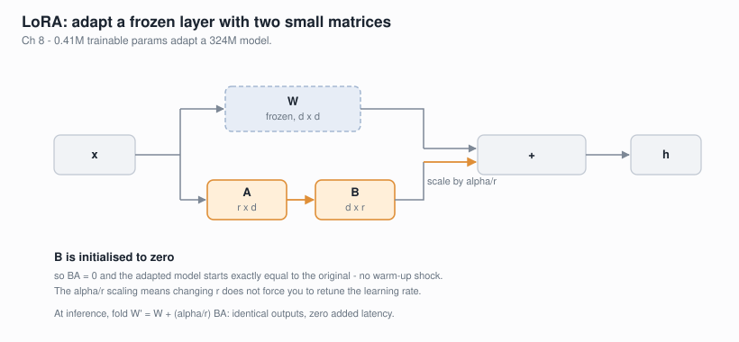
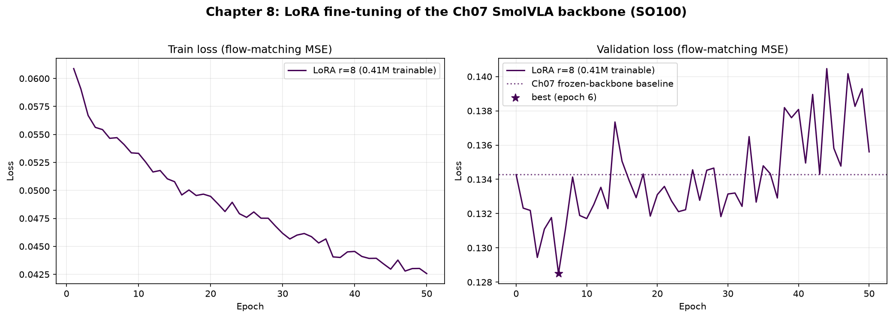

# Chapter 8: LoRA Fine-tuning — Adapting VLAs Without Retraining

**Goal:** Adapt a pretrained Vision-Language-Action model to a new task by
training a tiny set of **low-rank adapters** instead of the full network.
You will implement **LoRA from scratch**, apply it to our Chapter 7 SmolVLA,
and see the production recipe for LoRA fine-tuning the real 7B OpenVLA.



In Chapter 7 we froze a 303M backbone and trained a 20.8M action expert from
scratch. That is already parameter-efficient. This chapter goes further:
what if we want to adapt the *frozen language backbone itself*, or fine-tune a
giant pretrained VLA like OpenVLA-7B, on a single 24 GB GPU?

The answer is **LoRA** (Low-Rank Adaptation).

## The Idea in One Equation

A linear layer computes `y = W x`. Full fine-tuning updates all of `W`. LoRA
freezes `W` and learns a low-rank detour instead:

```
y = W x  +  (alpha / r) · B (A x)
         └──frozen──┘   └──trainable──┘

A : (r, in)    random init    r << min(in, out)
B : (out, r)   zero init      so the detour starts at exactly 0
```

Because `B` starts at zero, the adapted model is **identical** to the
pretrained one at step 0 — training only moves it as far as the data demands.
At inference you can fold `B @ A` back into `W` (`merge()`) so there is zero
added latency.

```
        x ──┬──────────────►  W (frozen)  ──────►(+)──► y
            │                                      ▲
            └──► A (r×in) ──► B (out×r) ──► ×s ─────┘
                 trainable     trainable
```

**Why it works:** the *update* a model needs to learn a new task has low
"intrinsic rank" — a rank-8 or rank-32 matrix captures most of it. So we
spend ~1% of the parameters and match full fine-tuning on most robot tasks.

## What's Here

| File | What it does |
|------|--------------|
| `lora.py` | From-scratch LoRA: `LoRALinear`, `inject_lora`, freeze/merge/checkpoint helpers. No `peft` dependency. |
| `finetune_smolvla.py` | Inject LoRA into our Chapter 7 SmolVLA's SmolLM2 backbone and fine-tune on the SO100 cache. |
| `lora_openvla.py` | Reference recipe for LoRA fine-tuning the real **OpenVLA-7B** with `peft` + 4-bit quantization. |
| `verify_baseline.py` | Paired baseline-vs-adapted validation check (identical noise draws per seed) so the reported improvement is real, not sampling noise. |
| `plot_results.py` | Render the training-curve figure and results table from the saved loss history. |
| `test_chapter_08.py` | Sanity tests (zero-init identity, freezing, merge correctness, checkpoint round-trip, gradient isolation). |

## Setup

```bash
cd chapters/08_finetuning
uv sync                      # core deps (torch, transformers)
uv run python lora.py        # standalone LoRA demo on a toy transformer
uv run pytest test_chapter_08.py -v

# Optional: the real OpenVLA-7B path needs peft + bitsandbytes
uv sync --extra openvla
```

## Part 1: LoRA From Scratch (`lora.py`)

The whole adapter is ~30 lines. The wrapper holds a frozen base layer plus two
small matrices:

```python
class LoRALinear(nn.Module):
    def __init__(self, base: nn.Linear, config: LoRAConfig):
        self.base = base                      # frozen
        self.base.weight.requires_grad = False
        self.lora_A = nn.Parameter(torch.empty(config.r, base.in_features))
        self.lora_B = nn.Parameter(torch.zeros(base.out_features, config.r))
        nn.init.kaiming_uniform_(self.lora_A, a=math.sqrt(5))  # A random, B zero

    def forward(self, x):
        return self.base(x) + self.scaling * (x @ self.lora_A.t() @ self.lora_B.t())
```

`inject_lora` walks the module tree and swaps any `nn.Linear` whose name
matches a target (e.g. `q_proj`, `v_proj`) for a `LoRALinear`. Then
`mark_only_lora_as_trainable` freezes everything else. Deployment uses
`merge_lora` to fold the adapters back into the base weights.

**Key properties the tests verify:**
- A fresh adapter leaves the output unchanged (zero-init `B`).
- Only `q_proj`/`v_proj` get wrapped; `k_proj`/`o_proj` are untouched.
- A gradient step moves *only* the LoRA factors.
- `merge()` then `forward()` matches the unmerged forward.
- The adapter checkpoint is a few KB, not the size of the model.

## Part 2: LoRA on Our SmolVLA (`finetune_smolvla.py`)

Chapter 7's `SmolVLA.forward` wraps the language model in `torch.no_grad()`
because the backbone was frozen. To train LoRA adapters *inside* that backbone
we must let gradients flow — so we drop the `no_grad` guard while keeping the
base weights frozen:

```python
# Chapter 7 (frozen backbone):
with torch.no_grad():
    vlm_out = self.vlm(inputs_embeds=prefix, ...)

# Chapter 8 (LoRA-adapted backbone):
vlm_out = self.vlm(inputs_embeds=prefix, ...)   # grads reach lora_A / lora_B only
```

We inject LoRA into the SmolLM2 attention projections and warm-start the action
expert from the Chapter 7 checkpoint. This reuses the **same cached vision
tokens** as Chapter 7 (`../07_full_vla/checkpoints/vla_cache.pt`), so no
re-extraction is needed.

```bash
# LoRA only (backbone adapts, expert frozen from Ch07)
uv run python finetune_smolvla.py --preset so100 --rank 8

# LoRA + continue training the action expert
uv run python finetune_smolvla.py --preset so100 --rank 16 --train-expert

# Wiring check with no downloads
uv run python finetune_smolvla.py --smoke
```

**Parameter comparison (SmolVLA backbone, rank 8, q/v targets):**

| Approach | Trainable params | % of model |
|----------|-----------------|------------|
| Ch07 action expert from scratch | 20.8M | 6.4% |
| Ch08 LoRA on backbone (r=8) | 0.41M | 0.13% |
| Ch08 LoRA + expert (r=16) | ~21M | 6.5% |

The LoRA-only path adapts the language backbone to the robot domain with
roughly **50x fewer** trainable parameters than training the expert.

## Results (SO100, r=8 LoRA-only, 50 epochs)

We fine-tune on the same 158-episode SO100 cache as Chapter 7 (138 train / 20
val episodes), injecting r=8 LoRA into the 16 SmolLM2 layers' q/v projections
(**0.41M trainable params, 0.13% of the model**) while the warm-started action
expert stays frozen. At step 0 — with LoRA's `B` matrix zero-initialized — the
model is byte-for-byte the Chapter 7 frozen-backbone policy, so its validation
loss is a directly comparable baseline.



*Left: train loss. Right: validation loss — the dotted line is the Ch07
frozen-backbone baseline and the star marks the best single-pass epoch. The
results table below reports the 8-seed paired mean, a less noisy estimator of
that same best checkpoint (hence the slightly different value).*

The flow-matching validation loss is **stochastic** (fresh noise + timestep per
batch), so a single pass is noisy and "best-of-N-epochs" selection biases the
number downward. We measure the real effect with a **paired** comparison
(`verify_baseline.py`): for each of 8 seeds, evaluate the frozen baseline and the
LoRA-adapted model on *identical* noise draws, then average the per-seed
difference.

| Model | Val loss (8 seeds) | Trainable params |
|-------|--------------------|------------------|
| Ch07 frozen backbone (baseline) | 0.13474 +/- 0.00123 | 0 |
| + r=8 LoRA on backbone | **0.12763 +/- 0.00129** | 0.41M (0.13%) |
| **Paired improvement** | **0.00711 +/- 0.00014 (+5.3%)** | — |

The paired difference is ~50x its own standard deviation, so the **+5.3%**
improvement is real, not sampling noise — LoRA adapts the frozen language
backbone to the robot domain with **0.13% of the model's parameters** and no
degradation.

**Two honest caveats:**

1. **It overfits fast.** Best validation is at epoch ~6; after that train loss
   keeps falling while val drifts back above baseline (right panel above). With
   only 158 episodes, even 0.41M new parameters start to memorize — early
   stopping matters. Same data-scarcity story as Chapters 5–7 (SmolVLA trained
   on 481 datasets; we use 3).
2. **Naively re-training the expert too** (`--train-expert`, r=16, ~21M params)
   **diverged** under Chapter 7's constant learning rate with no warmup — the
   loss blew up around epoch ~25. A warmup/decay schedule would likely stabilize
   it; left as an exercise, and its numbers are not reported here.

Reproduce:

```bash
uv run python finetune_smolvla.py --preset so100 --rank 8 --epochs 50
uv run python verify_baseline.py --seeds 8 --rank 8   # paired baseline check
uv run python plot_results.py                          # training-curve figure
```

## Part 3: The Real Thing — OpenVLA-7B (`lora_openvla.py`)

`peft` implements the same math we just wrote, at scale. The canonical OpenVLA
LoRA recipe fits a 7B model on one 24 GB GPU using 4-bit NF4 quantization:

```python
quant = BitsAndBytesConfig(load_in_4bit=True, bnb_4bit_quant_type="nf4",
                           bnb_4bit_compute_dtype=torch.bfloat16)
model = AutoModelForVision2Seq.from_pretrained("openvla/openvla-7b",
                                               quantization_config=quant)
model = get_peft_model(model, LoraConfig(r=32, lora_alpha=32,
                                         target_modules="all-linear",
                                         task_type="CAUSAL_LM"))
```

| Setting | Value |
|---------|-------|
| Base model | `openvla/openvla-7b` (Llama-2 7B + DINOv2 + SigLIP) |
| Quantization | 4-bit NF4 (frozen backbone) |
| LoRA rank / alpha | 32 / 32 |
| Targets | all linear layers |
| Trainable | ~110M (~1.5% of 7B) |
| Optimizer | AdamW, lr 5e-4, constant |
| Action head | 256-bin discrete tokens (Chapter 4) |

```bash
uv sync --extra openvla
uv run python lora_openvla.py --dry-run    # print recipe + check deps
```

The script degrades gracefully: if `peft`/`bitsandbytes` are missing it prints
install guidance and points you back to the runnable from-scratch path.

## Why LoRA Won for VLAs

1. **Memory.** Full fine-tuning of 7B needs ~140 GB of optimizer state. LoRA
   needs a few GB — a single consumer GPU.
2. **Catastrophic forgetting.** Freezing the backbone preserves the broad
   visual/language priors; you only nudge them toward the task.
3. **Shippable adapters.** A LoRA checkpoint is a few MB. You can keep one base
   model and swap task-specific adapters in and out.
4. **No inference cost.** `merge()` folds the adapter into the base weights.

## What This Chapter Demonstrates

1. **LoRA is simple.** The adapter is two matrices and a scaling factor.
2. **Injection is surgery.** Walk the tree, swap target `nn.Linear` layers,
   freeze the rest.
3. **The `no_grad` detail matters.** Adapting a previously-frozen backbone
   means re-enabling gradients through it — but only the adapters learn.
4. **The same idea scales.** From a 0.14M toy to OpenVLA-7B, the recipe is
   identical; only `peft` and quantization change.

## Next Steps (Chapter 9)

Chapter 9 closes the loop: evaluating a trained policy on the **LIBERO**
benchmark, and the **asynchronous action-chunking** inference pattern that
makes VLAs run in real time on a robot.

## References

- [LoRA: Low-Rank Adaptation of Large Language Models](https://arxiv.org/abs/2106.09685) — Hu et al., 2021
- [OpenVLA](https://arxiv.org/abs/2406.09246) — Kim et al., 2024 (7B VLA, LoRA fine-tuning)
- [QLoRA](https://arxiv.org/abs/2305.14314) — Dettmers et al., 2023 (4-bit + LoRA)
- [PEFT library](https://github.com/huggingface/peft) — Hugging Face LoRA implementation
